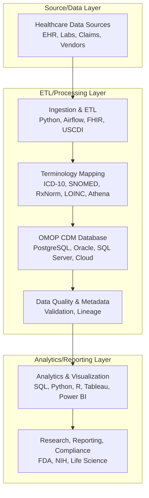

# Clinical Data Engineering Demo

This project demonstrates scalable, production-grade data engineering skills using Python and PostgreSQL, aligned with the Senior Manager, Data Engineering job requirements.

## Structure
- `etl/` — ETL scripts for ingesting, transforming, and loading data
- `data/` — Sample clinical data files
- `docs/` — Documentation and references


## Features
- Ingests and transforms sample clinical data
- Loads data into a PostgreSQL database using a simplified OMOP CDM schema
- Includes data validation and quality checks

## Data Workflow & System Integration

This project implements a modern clinical data engineering workflow, integrating healthcare standards, terminologies, databases, and analytics tools:

1. **Healthcare Data Sources:** EHRs, labs, registries, claims, and vendors provide data, often in HL7 FHIR format and containing USCDI-required elements. Example files: `data/person_sample.csv`, `data/observation_sample.csv`.
2. **Ingestion & ETL:** ETL pipelines (e.g., `etl/etl_load.py`) extract data from FHIR APIs, files, or databases, transform and map fields/codes to OMOP CDM tables and vocabularies (using mapping tables or vocabularies from Athena), and load harmonized data into relational databases (PostgreSQL, Oracle, SQL Server).
3. **Terminology Mapping:** Local codes (ICD-10, SNOMED, LOINC, etc.) are mapped to OMOP standard concept IDs using mapping tables or vocabularies. OMOP vocabularies are typically downloaded in bulk from the OHDSI Athena platform (https://athena.ohdsi.org/) and loaded into your database for use in the ETL process. See `data/code_mapping_sample.csv` for a demo.
4. **OMOP CDM Database:** OMOP CDM data is stored in scalable RDBMS or cloud data warehouses and can be integrated with data lakes for large-scale analytics. Schema: `docs/omop_cdm_schema.sql`.
5. **Data Quality & Metadata:** Automated validation checks for completeness, consistency, referential integrity, and code mapping are included in the ETL script. Data lineage and transformation steps are documented in the code and README.
6. **Analytics, Visualization, and Reporting:** SQL, Python (pandas, matplotlib), R, Tableau, and Power BI are used for cohort selection, EDA, modeling, dashboards, and regulatory reporting. See `etl/analytics_visualization.py` and charts in `docs/`.

### Data Workflow Diagram



## Requirements
- Python 3.8+
- PostgreSQL (local or cloud instance)
- Python packages: pandas, SQLAlchemy, psycopg2

## Setup
1. Install PostgreSQL and create a database (e.g., `clinical_demo`).
2. Install Python dependencies:
   ```bash
   pip install pandas sqlalchemy psycopg2-binary
   ```
3. Update database connection settings in `etl/etl_load.py`.
4. Run the ETL script:
   ```bash
   python etl/etl_load.py
   ```

For more details, see the scripts and documentation in each folder.
