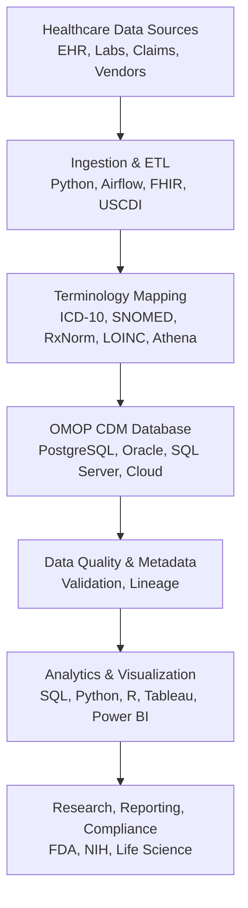

## Data Workflow & System Integration

This project implements a modern clinical data engineering workflow, integrating healthcare standards, terminologies, databases, cloud platforms, and analytics tools:

1. **Healthcare Data Sources:** EHRs, labs, registries, claims, and vendors provide data, often in HL7 FHIR format and containing USCDI-required elements. Example files: `data/person_sample.csv`, `data/observation_sample.csv`.
2. **Ingestion & ETL:** ETL pipelines (e.g., `etl/etl_load.py`) extract data from FHIR APIs, files, or databases, transform and map fields/codes to OMOP CDM tables and vocabularies (using mapping tables or services like Athena), and load harmonized data into relational databases (PostgreSQL, Oracle, SQL Server). Automation/orchestration tools (Airflow, Prefect, cloud-native) can manage and monitor workflows.
3. **Terminology Mapping:** Local codes (ICD-10, SNOMED, LOINC, etc.) are mapped to OMOP standard concept IDs using mapping tables or vocabularies. See `data/code_mapping_sample.csv` for a demo.
4. **OMOP CDM Database:** OMOP CDM data is stored in scalable RDBMS or cloud data warehouses (AWS, Azure, GCP) and can be integrated with data lakes for large-scale analytics. Schema: `docs/omop_cdm_schema.sql`.
5. **Data Quality & Metadata:** Automated validation checks for completeness, consistency, referential integrity, and code mapping are included in the ETL script. Data lineage and transformation steps are documented in the code and README.
6. **Analytics, Visualization, and Reporting:** SQL, Python (pandas, matplotlib), R, SAS, Tableau, and Power BI are used for cohort selection, EDA, modeling, dashboards, and regulatory reporting. See `etl/analytics_visualization.py` and charts in `docs/`.
7. **Security, Compliance, and Collaboration:** User roles, logging, and auditing support HIPAA/FDA/NIH compliance; collaboration with cross-functional teams and code management via GitHub.
8. **Continuous Improvement:** Stay current with new standards (FHIR, OMOP, USCDI), technologies, and best practices; adapt pipelines for new data sources, cloud, and regulatory needs.

### Data Workflow Diagram (Vertical One-Column Format)

## Advanced Data Systems & Techniques

- Experience with PostgreSQL, Oracle, SQL Server, and cloud data warehousing (AWS Redshift, Azure Synapse, Google BigQuery), as well as data lakes (S3, Blob Storage, GCS).
- Use of workflow/orchestration tools (Airflow, Prefect) for production ETL, and automation of validation, logging, and auditing for compliance and reproducibility.
- Knowledge of FHIR, HL7, USCDI for healthcare data exchange; can map FHIR to OMOP CDM. Work with ICD-10, SNOMED, RxNorm, LOINC, CPT/HCPCS for terminology standardization.
- Automated pipelines for completeness, consistency, accuracy, and anomaly detection; document data lineage, transformations, and quality checks; implement metadata catalogs.
- Use Python (matplotlib, seaborn), Tableau, Power BI for analytics and dashboards; prepare data for statistical modeling, predictive analytics, and real-world evidence studies (Python, R, SAS).
- Implement user roles, logging, and auditing for HIPAA/FDA/NIH compliance; collaborate with clinicians, data scientists, and IT; use GitHub for code management.
- Stay current with new data engineering and informatics technologies; adapt pipelines for new data sources, cloud platforms, and regulatory needs.

## Interview Preparation Talking Points

- **OMOP CDM:** Open standard for harmonizing and structuring diverse healthcare data (EHR, claims, registries) into a consistent, research-ready format. Enables interoperability, large-scale analytics, and reproducibility by mapping local codes to standard vocabularies (ICD, SNOMED, RxNorm, etc.). Widely adopted by the OHDSI community.
- **ETL Design:** Modular ETL pipeline in Python ingests raw clinical data, transforms it to OMOP CDM tables, and loads it into PostgreSQL. Scalable, reproducible, and easy to extend.
- **Data Quality:** Automated checks for missing values, duplicates, referential integrity, and out-of-range values. Ensures high data integrity for valid research and compliance.
- **Analytics & Insights:** SQL and Python (pandas, matplotlib) generate descriptive statistics and visualizations. Visual outputs help stakeholders understand data quality, cohort characteristics, and trends.
- **Alignment with Job Description:** Demonstrates scalable, production-grade data engineering using industry standards. Includes data quality, security, and documentation for compliance. Shows ability to collaborate and support analytics/research needs.
- **Extensibility:** Pipeline can be extended to cloud platforms, more data sources, and advanced analytics/BI tools.

---

For more details, see the code and scripts in each folder, and refer to the README for setup instructions.
