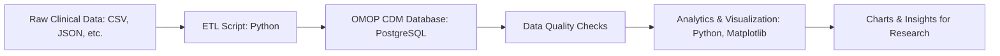

# Project Overview: OMOP Clinical Data Pipeline

This project demonstrates scalable clinical data engineering using Python, PostgreSQL, and the OMOP Common Data Model (CDM). It simulates real-world healthcare data workflows, including ETL, data quality checks, and analytics visualizations.

## Key Features
- End-to-end ETL pipeline for clinical data
- OMOP CDM schema implementation
- Automated data validation and quality checks
- Analytics and visualizations (age distribution, observations over time, etc.)
- Modular, production-grade code structure

## Usage
1. Clone the repository:
   ```bash
   git clone https://github.com/justin-mbca/omop-clinical-data-pipeline.git
   cd omop-clinical-data-pipeline
   ```
2. Set up your Python environment and install dependencies.
3. Configure your PostgreSQL connection in `etl/etl_load.py`.
4. Run the ETL and analytics scripts as described in the README.

## Visualizations
Sample output charts are saved in the `docs/` folder:
- Persons by gender
- Age distribution
- Observations per year/month
- Cumulative observations
- Top concepts over time

## Interview Preparation Talking Points
- **Workflow Diagram:**


- **OMOP CDM**: Explain what the OMOP Common Data Model is and why it’s used in healthcare for standardizing and integrating diverse clinical data sources.
- **ETL Design**: Discuss your approach to building scalable, modular ETL pipelines and how you ensured data quality and reproducibility.
- **Data Quality**: Highlight the automated checks for missing, duplicate, or out-of-range data, and how these support research integrity.
- **Analytics & Insights**: Describe how you used SQL and Python to extract insights and create visualizations that support research and business decisions.
- **Alignment with Job Description**: Emphasize how this demo covers scalable data engineering, regulatory compliance, collaboration, and support for analytics and research.
- **Extensibility**: Be ready to discuss how you would extend this pipeline for cloud deployment, larger datasets, or additional data sources.

---

For more details, see the code and scripts in each folder, and refer to the README for setup instructions.
