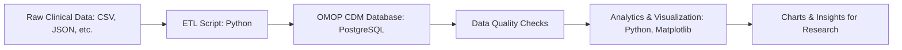

## How Data Systems, Standards, and Tools Interact

This section explains how healthcare data standards, terminologies, databases, cloud platforms, and analytics tools work together in a modern clinical data engineering workflow:

- **Data Sources & Standards:**
   - EHRs, labs, registries, claims, and vendors provide data, often in HL7 FHIR format and containing USCDI-required elements.
   - Healthcare terminologies (ICD-10, SNOMED, RxNorm, LOINC, CPT/HCPCS, Athena) are used for standardized coding.

- **Ingestion & ETL:**
   - ETL pipelines extract data from FHIR APIs, files, or databases, transform and map fields/codes to OMOP CDM tables and vocabularies, and load harmonized data into relational databases (PostgreSQL, Oracle, SQL Server).
   - Automation/orchestration tools (Airflow, Prefect, cloud-native) manage and monitor workflows.

- **Storage & Cloud:**
   - OMOP CDM data is stored in scalable RDBMS or cloud data warehouses (AWS, Azure, GCP) and can be integrated with data lakes for large-scale analytics.

- **Data Quality & Metadata:**
   - Automated validation checks for completeness, consistency, referential integrity, and code mapping; data lineage and transformation documentation ensure reproducibility.

- **Analytics, Visualization, and Reporting:**
   - SQL, Python, R, SAS, Tableau, and Power BI are used for cohort selection, EDA, modeling, dashboards, and regulatory reporting.

- **Security, Compliance, and Collaboration:**
   - User roles, logging, and auditing support HIPAA/FDA/NIH compliance; collaboration with cross-functional teams and code management via GitHub.

- **Continuous Improvement:**
   - Stay current with new standards (FHIR, OMOP, USCDI), technologies, and best practices; adapt pipelines for new data sources, cloud, and regulatory needs.

### Example Data Workflow Diagram

```mermaid
flowchart TD
      A[Healthcare Data Sources<br>(EHR, Labs, Claims, Vendors)] --> B[Ingestion & ETL<br>(Python, Airflow, FHIR, USCDI)]
      B --> C[Terminology Mapping<br>(ICD-10, SNOMED, RxNorm, LOINC, Athena)]
      C --> D[OMOP CDM Database<br>(PostgreSQL, Oracle, SQL Server, Cloud)]
      D --> E[Data Quality & Metadata<br>(Validation, Lineage)]
      E --> F[Analytics & Visualization<br>(SQL, Python, R, Tableau, Power BI)]
      F --> G[Research, Reporting, Compliance<br>(FDA, NIH, Life Science)]
```
## Advanced Data Systems & Techniques

- **Data Systems & Databases:**
   - Experience with PostgreSQL, Oracle, SQL Server; can adapt ETL and schema to enterprise systems.
   - Familiar with cloud data warehousing (AWS Redshift, Azure Synapse, Google BigQuery) and data lakes (S3, Blob Storage, GCS).

- **Data Frameworks & Pipelines:**
   - Use of workflow/orchestration tools (Airflow, Prefect) for production ETL.
   - Automation of validation, logging, and auditing for compliance and reproducibility.

- **Interoperability & Standards:**
   - Knowledge of FHIR, HL7, USCDI for healthcare data exchange; can map FHIR to OMOP CDM.
   - Work with ICD-10, SNOMED, RxNorm, LOINC, CPT/HCPCS for terminology standardization.

- **Data Quality & Metadata:**
   - Automated pipelines for completeness, consistency, accuracy, and anomaly detection.
   - Document data lineage, transformations, and quality checks; implement metadata catalogs.

- **Analytics, Visualization, and Reporting:**
   - Use Python (matplotlib, seaborn), Tableau, Power BI for analytics and dashboards.
   - Prepare data for statistical modeling, predictive analytics, and real-world evidence studies (Python, R, SAS).

- **Security, Compliance, and Collaboration:**
   - Implement user roles, logging, and auditing for HIPAA/FDA/NIH compliance.
   - Collaborate with clinicians, data scientists, and IT; use GitHub for code management.

- **Extensibility & Continuous Learning:**
   - Stay current with new data engineering and informatics technologies.
   - Adapt pipelines for new data sources, cloud platforms, and regulatory needs.
# Project Overview: OMOP Clinical Data Pipeline

This project demonstrates scalable clinical data engineering using Python, PostgreSQL, and the OMOP Common Data Model (CDM). It simulates real-world healthcare data workflows, including ETL, data quality checks, and analytics visualizations.

## Key Features
- End-to-end ETL pipeline for clinical data
- OMOP CDM schema implementation
- Automated data validation and quality checks
- Analytics and visualizations (age distribution, observations over time, etc.)
- Modular, production-grade code structure

## Usage
1. Clone the repository:
   ```bash
   git clone https://github.com/justin-mbca/omop-clinical-data-pipeline.git
   cd omop-clinical-data-pipeline
   ```
2. Set up your Python environment and install dependencies.
3. Configure your PostgreSQL connection in `etl/etl_load.py`.
4. Run the ETL and analytics scripts as described in the README.

## Visualizations
Sample output charts are saved in the `docs/` folder:
- Persons by gender
- Age distribution
- Observations per year/month
- Cumulative observations
- Top concepts over time

## Interview Preparation Talking Points
- **OMOP CDM:**
   - The OMOP Common Data Model (CDM) is an open standard for harmonizing and structuring diverse healthcare data (EHR, claims, registries) into a consistent, research-ready format.
   - Enables interoperability, large-scale analytics, and reproducibility by mapping local codes to standard vocabularies (ICD, SNOMED, RxNorm, etc.).
   - Widely adopted by the OHDSI community, OMOP CDM supports multi-center studies and regulatory submissions.

- **ETL Design:**
   - Designed a modular ETL pipeline in Python that ingests raw clinical data, transforms it to OMOP CDM tables, and loads it into PostgreSQL.
   - The pipeline is scalable (can handle more data sources/tables), reproducible (scripted, version-controlled), and easy to extend.
   - Each step (extract, transform, load) is separated for clarity and maintainability.

- **Data Quality:**
   - Automated checks include: missing values, duplicates, referential integrity (foreign keys), and out-of-range values (e.g., future birth years).
   - These checks are run before loading data, and errors are logged for review.
   - Ensures high data integrity, which is critical for valid research and regulatory compliance.

- **Analytics & Insights:**
   - Used SQL and Python (pandas, matplotlib) to generate descriptive statistics and visualizations (age distribution, trends, concept frequencies).
   - Visual outputs help stakeholders quickly understand data quality, cohort characteristics, and trends.
   - The approach supports both ad-hoc queries and reproducible reporting.

- **Alignment with Job Description:**
   - Demonstrates scalable, production-grade data engineering using industry standards (OMOP, PostgreSQL, Python).
   - Includes data quality, security (user roles), and documentation for compliance.
   - Shows ability to collaborate (modular code, clear documentation) and support analytics/research needs.

- **Extensibility:**
   - The pipeline can be extended to cloud platforms (AWS RDS, Azure Database) for scalability and managed services.
   - Can add more data sources (e.g., FHIR, HL7) or automate ingestion with workflow tools (Airflow, Prefect).
   - Supports integration with BI tools (Power BI, Tableau) and advanced analytics (machine learning, real-world evidence studies).
- **Workflow Diagram:**


- **OMOP CDM**: Explain what the OMOP Common Data Model is and why it’s used in healthcare for standardizing and integrating diverse clinical data sources.
- **ETL Design**: Discuss your approach to building scalable, modular ETL pipelines and how you ensured data quality and reproducibility.
- **Data Quality**: Highlight the automated checks for missing, duplicate, or out-of-range data, and how these support research integrity.
- **Analytics & Insights**: Describe how you used SQL and Python to extract insights and create visualizations that support research and business decisions.
- **Alignment with Job Description**: Emphasize how this demo covers scalable data engineering, regulatory compliance, collaboration, and support for analytics and research.
- **Extensibility**: Be ready to discuss how you would extend this pipeline for cloud deployment, larger datasets, or additional data sources.

---

For more details, see the code and scripts in each folder, and refer to the README for setup instructions.
